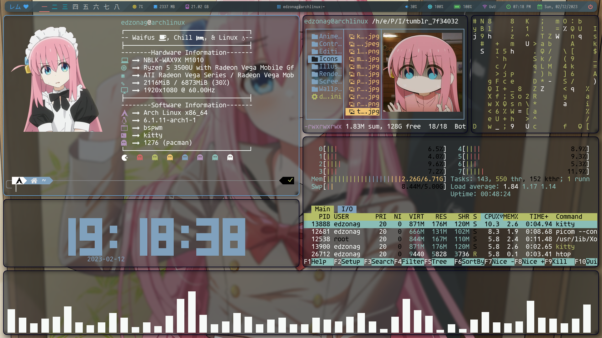

<h1 align="center"> Dotfiles Archcraft (BSPWM) </h1>

## About

This repo contains my most frequently used config files. If you use the same programs as I do then they may be useful to you. Please make sure you read through the config files to know if they will be useful to you and what you may want to change.



## Dependencies

 * [rofi](https://github.com/davatorium/rofi)
 * [kitty](https://github.com/kovidgoyal/kitty)
 * [bspwm](https://github.com/baskerville/bspwm) (optional*)
 * [Polybar](https://github.com/polybar/polybar)
 * [betterlockscreen](https://github.com/pavanjadhaw/betterlockscreen)   
 * nitrogen 
 * Font Awesome
 * [clearine](https://github.com/okitavera/clearine)

## Instalation

As you can see there is no installer, the installation is manual

* Install the dependencies
* Clone the repository on your pc with

```bash
git clone https://github.com/EdzonAG/dotfiles-archcraft.git
```
* Install the required fonts by copying *usr* directory to your */* directory      
> **Note : for Source han and ttf-font-awesome, install it from your repository**          
> **Arch : sudo pacman -S adobe-source-han-sans-jp-fonts ttf-font-awesome**
* Install powerlevel10k on your `.config` directory
* copy all `.config` files to your .config directory, 
* install oh-my zsh then manually then move `.zshrc` into your `home` directory
* Set the wallpaper using nitrogen  
* Set Lockscreen Wallpaper using this command      
> betterlockscreen -u /path/to/wallpaper.png
To apply The GTK Theme and icons, you can use LXappearance  

## Good luck

<p align="center"> 


